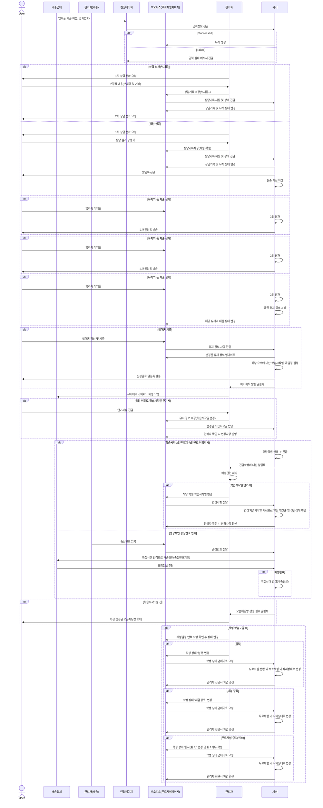

## Getting Started

```mermaid
sequenceDiagram
  Actor Customer as User
  participant 배송업체 as 배송업체
  participant 관리자(배송) as 관리자(배송)
  participant 렌딩페이지 as 렌딩페이지
  participant 백오피스 as 백오피스(무료체험페이지)
  participant 관리자 as 관리자
  participant 서버 as 서버

  Customer ->> 렌딩페이지: 입력폼 제출(이름, 전화번호)
  렌딩페이지 ->> 서버: 입력정보 전달
  alt Successful
    서버 ->> 백오피스: 유저 생성
  else Failed
  서버 ->> 렌딩페이지: 입력 실패 메시지 전달
  end
  alt 상담 실패(부재중)
    관리자 ->> Customer: 1차 상담 전화 요청
    Customer ->> 관리자: 부정적 대응(부재중 및 기타)
    관리자 ->> 백오피스: 상담기록 저장(부재중..)
    백오피스 ->> 서버: 상담기록 저장 및 상태 전달
    서버 ->> 백오피스: 상담기록 및 유저 상태 변경
    관리자 ->> Customer: 2차 상담 전화 요청
  else 상담 성공
    관리자 ->> Customer: 1차 상담 전화 요청
    Customer ->> 관리자: 상담 결과 긍정적
    관리자 ->> 백오피스: 상담기록작성(체험 확정)
    백오피스 ->> 서버: 상담기록 저장 및 상태 전달
    서버 ->> 백오피스: 상담기록 및 유저 상태 변경
    서버 ->> Customer: 알림톡 전달
    서버 ->> 서버: 발송 시점 저장
end
alt 유저의 폼 제출 실패
    Customer ->> 백오피스: 입력폼 미제출
    서버 ->> 서버: 2일 경과
    서버 ->> Customer: 2차 알림톡 발송
end
alt 유저의 폼 제출 실패
    Customer ->> 백오피스: 입력폼 미제출
    서버 ->> 서버: 2일 경과
    서버 ->> Customer: 3차 알림톡 발송
end
alt 유저의 폼 제출 실패
    Customer ->> 백오피스: 입력폼 미제출
    서버 ->> 서버: 2일 경과
    서버 ->> 서버: 해당 유저 취소 처리
    서버 ->> 백오피스 : 해당 유저에 대한 상태 변경
end
alt 입력폼 제출
    Customer ->> 백오피스 : 입력폼 작성 및 제출
    백오피스 ->> 서버 : 유저 정보 사항 전달
    서버 ->> 백오피스 : 변경된 유저 정보 업데이트
    서버 ->> 서버 : 해당 유저에 대한 학습시작일 및 일정 결정
    서버 ->> Customer: 신청완료 알림톡 발송
    서버 ->> 관리자 : 아이패드 발송 알림톡
end
관리자 ->> 배송업체 : 유저에게 아이패드 배송 요청
alt 특정 이유로 학습시작일 연기시
    Customer ->> 관리자 : 연기사유 전달
    관리자 ->> 백오피스 : 유저 정보 수정(학습시작일 변경)
    백오피스 ->> 서버 : 변경된 학습시작일 반영
    서버 ->> 백오피스 : 관리자 확인 시 변경사항 반영
end
alt 학습시작 3일전까지 송장번호 미입력시
    서버 ->> 서버 : 해당학생 상태 -> 긴급
    서버 ->> 관리자 : 긴급학생에 대한 알림톡
    관리자 ->> 관리자 : 배송관련 처리
    alt 학습시작일 연기시
        관리자 ->> 백오피스 : 해당 학생 학습시작일 변경
        백오피스 ->> 서버 : 변경사항 전달
        서버 ->> 서버 : 변경 학습시작일 기점으로 일정 재산출 및 긴급상태 변경
        서버 ->> 백오피스 : 관리자 확인 시 변경사항 갱신
    end
else 정상적인 송장번호 입력
    관리자(배송) ->> 백오피스 : 송장번호 입력
    백오피스 ->> 서버 : 송장번호 전달
    서버 ->> 배송업체 : 특정시간 간격으로 배송조회(송장번호기준)
    배송업체 ->> 서버 : 조회정보 전달
    alt 배송완료
        서버 ->> 서버 : 학생상태 변경(배송완료)
    end
end
alt 학습시작 1일 전
    서버 ->> 관리자 : 오픈채팅방 생성 필요 알림톡
    관리자 ->> Customer : 학생 생성된 오픈채팅방 초대
end
alt 체험 학습 7일 후
    관리자 ->> 백오피스 : 체험일정 만료 학생 확인 후 상태 변경
    alt 입학
        관리자 ->> 백오피스 : 학생 상태 '입학' 변경
        백오피스 ->> 서버 : 학생 상태 업데이트 요청
        서버 ->> 서버 : 유료회원 전환 및 무료체험 내 삭제상태로 변경
        서버 ->> 백오피스 : 관리자 접근시 화면 갱신
    end
    alt 체험 종료
        관리자 ->> 백오피스 : 학생 상태 '체험 종료' 변경
        백오피스 ->> 서버 : 학생 상태 업데이트 요청
        서버 ->> 서버 : 무료체험 내 삭제상태로 변경
        서버 ->> 백오피스 : 관리자 접근시 화면 갱신
    end
    alt 무료체험 중지(취소)
        관리자 ->> 백오피스 : 학생 상태 '중지(취소)' 변경 및 취소사유 작성
        백오피스 ->> 서버 : 학생 상태 업데이트 요청
        서버 ->> 서버 : 무료체험 내 삭제상태로 변경
        서버 ->> 백오피스 : 관리자 접근시 화면 갱신
    end
end


```
