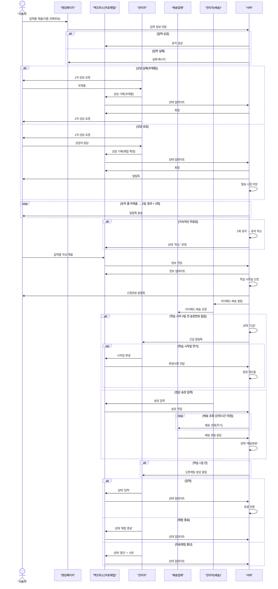

## 무료체험 진행 구조도

```mermaid
sequenceDiagram
  %% ───── 참가자 선언 ─────
  actor    Customer        as "사용자"
  participant Landing      as "렌딩페이지"
  participant Backoffice   as "백오피스(무료체험)"
  participant Manager      as "관리자"
  participant DeliveryComp as "배송업체"
  participant DeliveryAdmin as "관리자(배송)"
  participant Server       as "서버"

  %% 1) 기본 입력
  Customer  ->> Landing  : 입력폼 제출(이름·전화번호)
  Landing   ->> Server   : 입력 정보 전달

  alt 입력 성공
      Server  ->> Backoffice : 유저 생성
  else 입력 실패
      Server  ->> Landing    : 실패 메시지
  end

  %% 2) 1차 상담
  alt 상담 실패(부재중)
      Manager  ->> Customer : 1차 상담 요청
      Customer ->> Manager  : 부재중
      Manager  ->> Backoffice : 상담 기록(부재중)
      Backoffice ->> Server : 상태 업데이트
      Server ->> Backoffice : 확정
      Manager  ->> Customer : 2차 상담 요청
  else 상담 성공
      Manager  ->> Customer : 1차 상담 요청
      Customer ->> Manager  : 긍정적 응답
      Manager  ->> Backoffice : 상담 기록(체험 확정)
      Backoffice ->> Server  : 상태 업데이트
      Server ->> Backoffice : 확정
      Server ->> Customer   : 알림톡
      Server ->> Server     : 발송 시점 저장
  end

  %% 3) 폼 미제출 알림 3‑스텝 루프
  loop 유저 폼 미제출 → 2일 경과 × 3회
      Server  ->> Customer : 알림톡 발송
  end
  alt 지속적인 무응답
    Server ->> Server : 3회 경과 → 유저 취소
    Server ->> Backoffice : 상태 "취소" 반영
  end

  %% 4) 폼 제출 후
  Customer ->> Backoffice : 입력폼 작성·제출
  Backoffice ->> Server   : 정보 전달
  Server ->> Backoffice   : 정보 업데이트
  Server ->> Server       : 학습 시작일 산정
  Server ->> Customer     : 신청완료 알림톡
  Server ->> DeliveryAdmin: 아이패드 배송 알림

  DeliveryAdmin ->> DeliveryComp : 아이패드 배송 요청

  %% 5) 송장번호 흐름
  alt 학습 시작 3일 전 송장번호 없음
      Server ->> Server   : 상태 "긴급"
      Server ->> Manager  : 긴급 알림톡
      opt 학습 시작일 연기
          Manager ->> Backoffice : 시작일 변경
          Backoffice ->> Server  : 변경사항 전달
          Server ->> Server      : 일정 재산출
      end
  else 정상 송장 입력
      DeliveryAdmin ->> Backoffice : 송장 입력
      Backoffice    ->> Server     : 송장 전달
      loop 배송 조회 (단위시간 미정)
        Server        ->> DeliveryComp : 배송 조회(주기)
      end
      DeliveryComp  ->> Server     : 배송 완료 응답
      Server        ->> Server     : 상태 "배송완료"
  end

  %% 6) 오픈채팅 안내
  alt 학습 1일 전
    Server ->> Manager  : 오픈채팅 생성 알림
  end

  %% 7) 체험 7일 후 상태 결정
  alt 입학
      Manager ->> Backoffice : 상태 '입학'
      Backoffice ->> Server  : 상태 업데이트
      Server ->> Server      : 유료 전환
  else 체험 종료
      Manager ->> Backoffice : 상태 '체험 종료'
      Backoffice ->> Server  : 상태 업데이트
  else 무료체험 중단
      Manager ->> Backoffice : 상태 '중단' + 사유
      Backoffice ->> Server  : 상태 업데이트
  end

```
