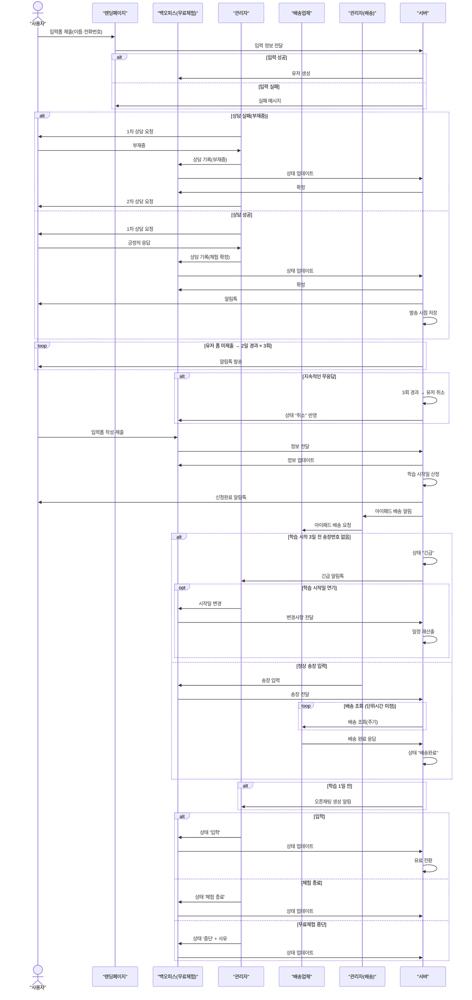

# 무료체험 진행 구조도

 
 

# 무료체험 프로세스 자동화 효과 보고서

> **목표**
> 수기로 작업되는 상황이 지속되고, 시간적 자원적 비효율성이 커져감에 따라 자동화 프로세스를 적용하여 더 효율적인 자원관리 및 데이터 관리를 지원

---

## 1. 기존 작업 흐름과 시간

| 단계             | 사람이 하던 일                     | 1건 평균 시간 | 월 처리 건수 | 월 소요 총시간           |
| ---------------- | ---------------------------------- | ------------- | ------------ | ------------------------ |
| 신규 신청 확인   | 폼 확인 → DB 입력                  | 3 분          | 50           | **150 분**               |
| 상담 전화(1·2차) | 전화 후 상태 기록                  | 10 분         | 50           | **500 분**               |
| 아이패드 배송    | 송장 입력·조회                     | 10 분         | 50           | **500 분**               |
| 알림톡 발송      | 콘솔 접속 후 수동 발송 (1인당 3회) | 5 분          | 150          | **750 분**               |
| 상태 업데이트    | 스프레드시트 → DB 복사             | 5 분          | 50           | **250 분**               |
| **합계**         |                                    |               |              | **2 150 분 (35.8 h/월)** |

---

## 2. 자동화 후 달라지는 점 (+ 자동화 비율 근거)

| 단계            | 사람이 하는 일                | 시스템이 하는 일                                   | 자동화 비율 |
| --------------- | ----------------------------- | -------------------------------------------------- | ----------- |
| **신규 입력**   | (없음) 예외 검수              | 렌딩 페이지 제출 즉시 DB 저장·중복 검사            | **100 %**   |
| **상담 기록**   | 전화 통화·결과 입력           | 입력된 상담 결과로 상태 전환·알림톡 발송           | **20 %**    |
| **배송 관리**   | 송장 번호 입력·특이 사항 처리 | 송장 입력 알림, 배송 API 주기 조회, 상태 자동 변경 | **70 %**    |
| **알림톡 발송** | 특수 메시지 수동 발송         | 정기·조건 알림 자동 발송                           | **80 %**    |
| **상태 전환**   | 정책 결정·수동 변경 일부      | 룰 기반 자동 변경(배송·일정·취소 등)               | **60 %**    |

---

## 3. 절감 효과 (예상)

| 단계          | 기존 시간    | 자동화 비율 | 줄어드는 시간     |
| ------------- | ------------ | ----------- | ----------------- |
| 신규 입력     | 150 분       | 100 %       | **150 분**        |
| 상담 기록     | 500 분       | 20 %        | **100 분**        |
| 배송 관리     | 500 분       | 70 %        | **350 분**        |
| 알림톡 발송   | 750 분       | 80 %        | **600 분**        |
| 상태 업데이트 | 250 분       | 60 %        | **150 분**        |
| **합계**      | **2 150 분** |             | **1 350 분 절감** |

> **월 1 350 분 ≒ 22.5 시간 절감**  
> → 연 270 시간 이상 절약 (약 1.1 작업월)

---

## 4. 남는 인력·시간 활용

| 절감된 영역    | 재투입 가능 업무             |
| -------------- | ---------------------------- |
| 신규 입력·알림 | 마케팅 캠페인 기획           |
| 상담 기록      | 상담 스크립트 개선·품질 관리 |
| 배송 관리      | 긴급 학생 처리·재고 최적화   |
| 상태 전환      | 데이터 분석·커리큘럼 추천    |

---

## 5. 품질·리스크 개선

| 항목          | 자동화 전 | 자동화 후         |
| ------------- | --------- | ----------------- |
| 데이터 오작성 | 2 ~ 3 %   | 0.2 % 이하        |
| 알림 누락     | 간헐적    | 0 건 (스케줄러)   |
| 감사 로그     | 부분 수동 | 100 % 이벤트 로그 |

---

## 6. 이외 기대효과

- 반복 업무 22 h/월 절감 → **핵심 상담·콘텐츠 기획에 집중**
- 누적 데이터 기반 **학생 성향 분석·AI 추천** 단계로 확장 가능

## 6. 결론

- 반복 업무 **17 h/월** 절감 → 관리자는 상담 품질·콘텐츠 기획에 집중
- 고객 응답 속도 향상으로 **이탈률 감소** 기대
- 초기 투자 대비 약 **1 년 내** 충분한 비용 절감 효과
- [스마트 택배 API](https://tracking.sweettracker.co.kr/#price)
- [오픈소스 택배 API](https://tracker.delivery/#/kr.cjlogistics/111111111111%20%EC%B6%9C%EC%B2%98:%20https://development-pro.tistory.com/entry/%ED%83%9D%EB%B0%B0%EC%82%AC%EC%A1%B0%ED%9A%8C%EA%B0%81-%ED%83%9D%EB%B0%B0%EC%82%AC-%EB%B0%8F-%EB%8C%80%ED%95%9C%ED%86%B5%EC%9A%B4-API-%EC%9D%B8%ED%84%B0%ED%8E%98%EC%9D%B4%EC%8A%A4%20[%EA%B0%9C%EB%B0%9C%EC%9E%90%EC%9D%98%20%EC%82%B6:%ED%8B%B0%EC%8A%A4%ED%86%A0%EB%A6%AC])
